# Jenkins Docs

 * ##  **How To Install Jenkins on Ubuntu 20.04**

 ### **Prerequisites**

To follow this tutorial, you will need Oracle JDK 11 installed , <a href="https://www.digitalocean.com/community/tutorials/how-to-install-java-with-apt-on-ubuntu-20-04" target="_blank"> Java 11 installation . </a>
    
    P.S : Oracle jdk 14 is not supported right now by Jenkins .

### **Step 1 — Installing Jenkins**  :

 * First, add the repository key to the system:

    ```bash
    wget -q -O - https://pkg.jenkins.io/debian-stable/jenkins.io.key | sudo apt-key add -
    ```
    After the key is added the system will return with OK.


 *  Next, let’s append the Debian package repository address to the server’s sources.list:

    ```bash
    sudo sh -c 'echo deb http://pkg.jenkins.io/debian-stable binary/ > /etc/apt/sources.list.d/jenkins.list'

    ```
 * After both commands have been entered, we’ll run update so that apt will use the new repository :
    
    ```bash
    sudo apt update
    ```
 * Finally, we’ll install Jenkins and its dependencies:
    
      ```bash
    sudo apt install jenkins
    ```

### **Step 2 —Starting Jenkins :**

 * Let’s start Jenkins by using systemctl:
    
    ```bash
    sudo systemctl start jenkins
    ```
 * Since systemctl doesn’t display status output, we’ll use the status command to verify that Jenkins started successfully:

    ```bash
    sudo systemctl status jenkins
    ```
 * If everything went well, the beginning of the status output shows that the service is active and configured to start at boot:
  
   Output
    
    ```bash
    ● jenkins.service - LSB: Start Jenkins at boot time
    Loaded: loaded (/etc/init.d/jenkins; generated)
    Active: active (exited) since Fri 2020-06-05 21:21:46 UTC; 45s ago
    Docs: man:systemd-sysv-generator(8)
    Tasks: 0 (limit: 1137)
    CGroup: /system.slice/jenkins.service
    ```

### **Step 3  —Setting Up Jenkins :**
   
* To set up your installation, visit Jenkins on its default port, 8080, using your server domain name or IP address: http://**your_server_ip_or_domain**:8080
 
    You should receive the Unlock Jenkins screen, which displays the location of the initial password:

    

* In the terminal window, use the cat command to display the password: 
 
    ```bash
    sudo cat /var/lib/jenkins/secrets/initialAdminPassword
    ```

    Copy the 32-character alphanumeric password from the terminal and paste it into the Administrator password field, then click Continue.

* The next screen presents the option of installing suggested plugins or selecting specific plugins:

    
 

* We’ll click the Install suggested plugins option, which will immediately begin the installation process :

    

* When the installation is complete, you’ll be prompted to set up the first administrative user :

     

* You’ll receive an Instance Configuration page that will ask you to confirm the preferred URL for your Jenkins instance. Confirm either the domain name for your server or your server’s IP address (http://localhost:8080/  in case if you're working locally ):

     

* After confirming the appropriate information, click Save and Finish. You’ll receive a confirmation page confirming that “Jenkins is Ready!”: 

     

* Click Start using Jenkins to visit the main Jenkins dashboard ,  At this point, you have completed a successful installation of Jenkins.

---


* ## **Create CI/CD Pipeline with Jenkins, Docker , GitLab and Spring Boot**

### **Prerequisites**

* Maven version 3 or higher installed ,  <a href="https://linuxize.com/post/how-to-install-apache-maven-on-ubuntu-20-04/" target="_blank"> Maven installation Link   </a> .
* Docker installed on your Jenkins server , <a href="https://docs.docker.com/engine/install/ubuntu/" target="_blank"> Docker instalation Ubuntu   </a>  .    

* GitLab or Github repository for version control system . 

* A basic Spring Boot  hello world project . 


### **Step 1 — Setting up  Jenkins  Project  :**

* From the Jenkins home page (i.e. the Dashboard of the Jenkins  classic UI), click New Item at the top left.

    
* In the Enter an item name field, specify the name for your new       Pipeline project. . 
* For this tutorial , we'll go through the pipeline method .  

* Scroll down and click Pipeline, then click OK at the end of the page to open the Pipeline configuration page (whose General tab is selected).    
    
    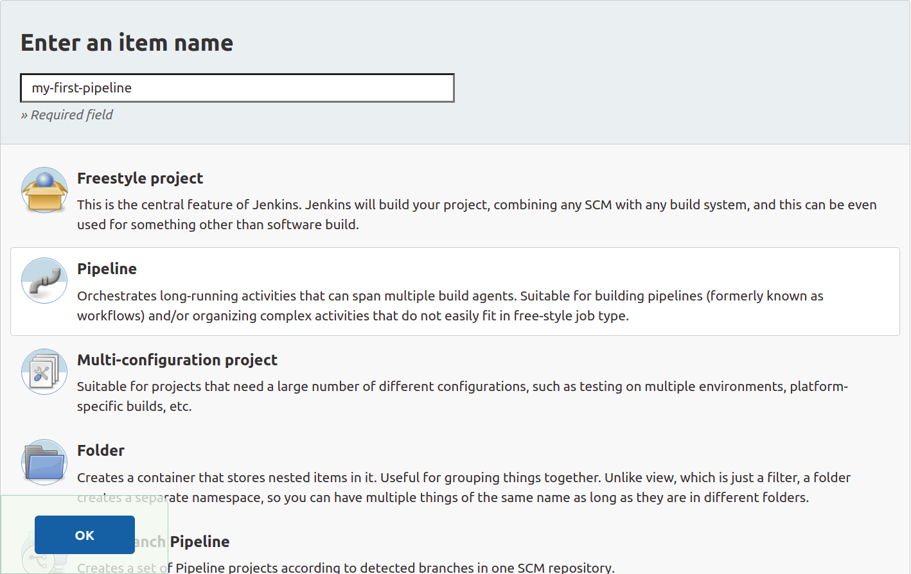


### **Step 2 — Configuring Jenkins Pipeline   :**

* Click the Pipeline tab at the top of the page to scroll down to the Pipeline section. 

    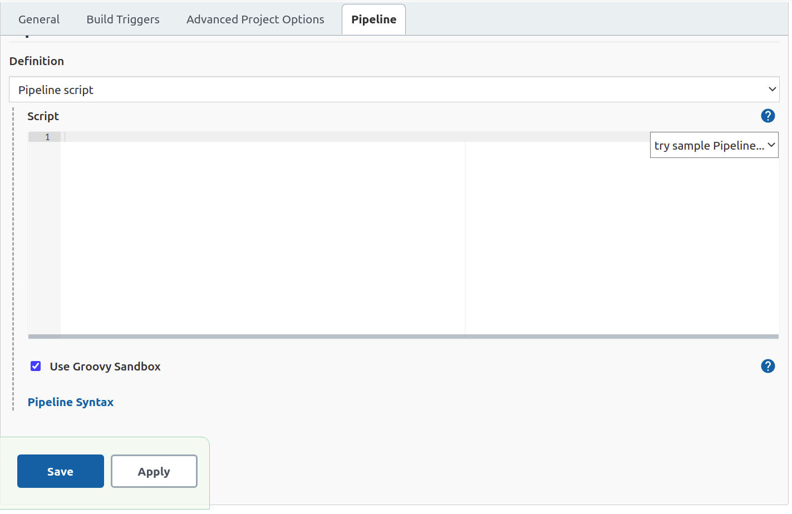
* We'll define four Stage  in ou Pipeline : 
    
    1. SCM Checkout : cloning the code from GitLab remote repository .
    2. Package jar : Transform our spring boot application in an executable jar file .
    3. Build Docker image . 
    4. Deploy & Test . 

So Let's start and have fun with our pipeline .


#### **2.1 - SCM Checkout Stage    :** 

* Following the best practice , Jenkins need credentials to clone our remote repository , so we need to add our GitLab credentials to Jenkins , in our case we'll go through SSH Key credentials .

    **P.S : you dont need any credentials if the repository is public , but this approch is not recommended for production usage.**

* In the project setting page were we are , scroll down until the end and open  **Pipeline Syntax** in a new tab to generate script for accessing our repository .

    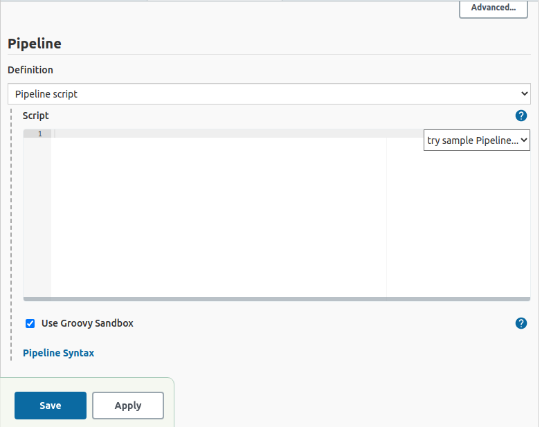

* In the **Sample Step** of the **Steps** section choose Git  .
* Put your repository url in the **Repository URL** field .
* Choose your branch name , in our case it's main .

    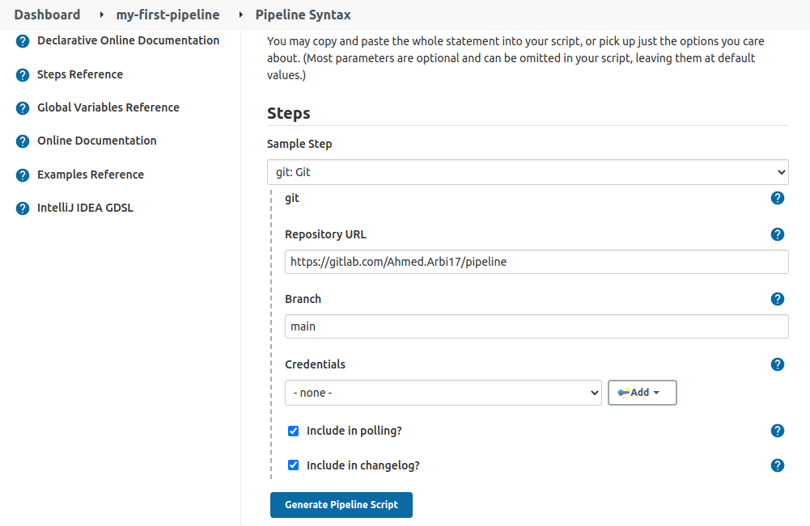

  **P.S: if your repository is public you can skip the next step .**
* Now we need to add our credentials to grant Jenkins access to our repository .
* Click **Add** button in the **Credentials** field then choose **Jenkins** .

    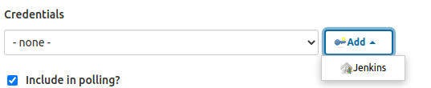

* A new window will appear .
* Choose the kind of credentials , in our case **SSH Username with private key** 

    **P.S : you can use your git  username and password instead of ssh key , but it's not recommended.** 

* Choose an ID for your credentials .
* Add a description to your credentials.
* Put in your git username .

    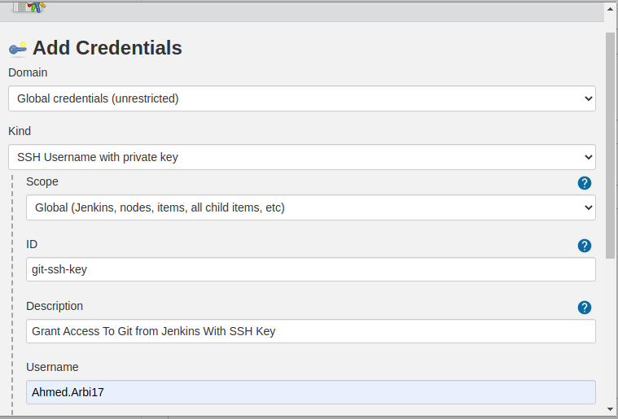
* In the Private Key area click the **Add** button to enter your private Key . 
    
    **P.S: if you don't have any key you can follow this <a href="https://docs.gitlab.com/ee/ssh/" target="_blank">  Link   </a>  to add an SSH Key to your GitLab account.**

     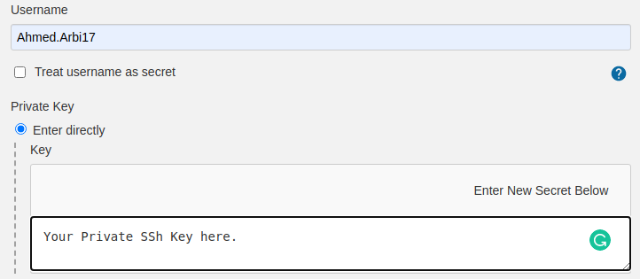

* Click **Add** at the bottom to generate your credentials.

* Now let's come back to our pipeline syntax and choose our credentials .

     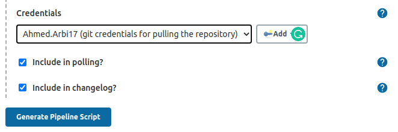

* Click Generate Pipeline Script and copy the script generated . 

     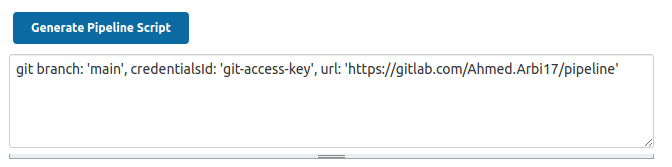

* Now our configuartion and script are ready to use , go back to the project setting area .

    

* Add the following script : 
    ```bash
    node {
    stage('SCM Checkout'){
        
        echo " Starting cloning remote repository ..."
        git branch: 'main', credentialsId: 'YourCredentialsId', url: 'YourRepositoryUrl'
        echo " Ending cloning remote repository"
        
    }
    }
    ```
* Choose Your stage Name , and put in your credentials ID and your repository Url in the appropriate field.

* Click Save . you'll be redirected to your project main page . 

* Click **Build Now** to build the first stage , and here we go the build succeeded . 

    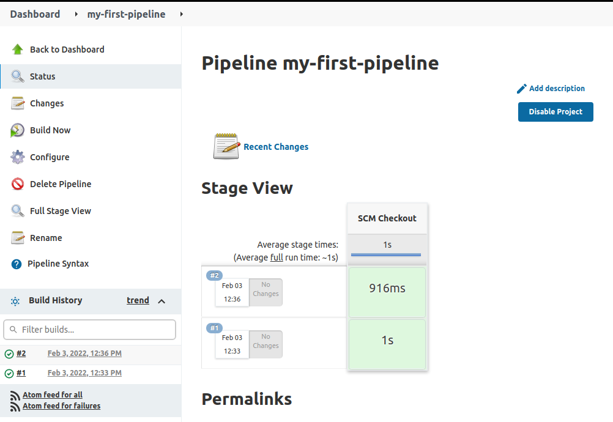


#### **2.2 - Package Jar  :** 

* In this stage we'll package our spring boot application into a jar file with maven , 
 You should have maven 3  or higher installed on your Jenkins server . 

* Build failure may occur when using maven command **i.e: mvn clean package** .
  If you're in this case here is a <a href="https://stackoverflow.com/questions/45777031/maven-not-found-in-jenkins/56833922/" target="_blank">  Link   </a>  to solve the issue. 

* Now let's add our script for the second stage ,in your project main page click **Configure** in the left side bar 

    

* Copy and Paste the following Script to our **Pipeline Script** 

    ```bash
        stage('Package Jar') {
        echo " Packaging application jar starting ... "
        sh "mvn clean package"
        echo " Packaging application jar finished ... "
    }
    ```

* The following is the the global pipeline script we get : 

    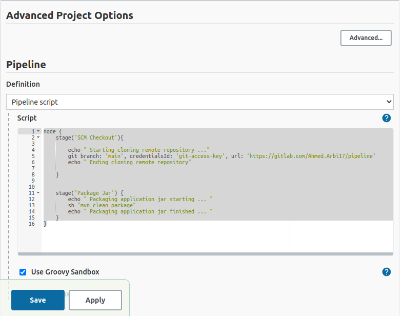

* Click Save and you will be redirect to the project main page .
* Click Build Now .
* Here we go , our build for the second stage succed. 
    
    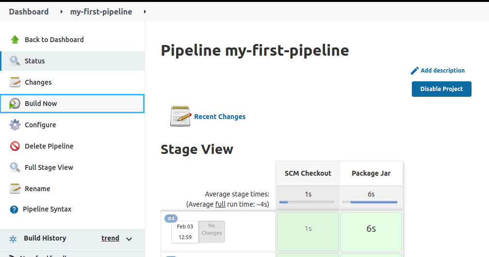

    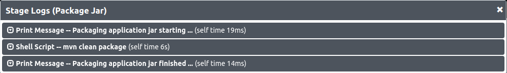

#### **2.3 - Building docker image  :**

* Our repository contain the following Dockerfile that we need to build our image.

    ```bash
        FROM openjdk:8-jdk-alpine
        ADD target/demo-0.0.1-SNAPSHOT.jar app.jar
        ENTRYPOINT ["java","-jar","app.jar"]
    ```
* In your project main page click **Configure** in the left side bar.
* Copy and Paste the following Script to our **Pipeline Script** .

    ```bash
    stage(' Build Docker image') {
    echo " Starting build Docker image"
    sh "docker build -t my-app:1.0.0 ."
    echo " Finishing build Docker image"
    }
    ```
* Our global script now is : 
    ```bash 
    node {
    stage('SCM Checkout'){
        
        echo " Starting cloning remote repository ..."
        git branch: 'main', credentialsId: 'git-access-key', url: 'https://gitlab.com/Ahmed.Arbi17/pipeline'
        echo " Ending cloning remote repository"
        
    }
    
    stage('Package Jar') {
        echo " Packaging application jar starting ... "
        sh "mvn clean package"
        echo " Packaging application jar finished ... "
    }
    stage(' Build Docker image') {
        
        echo " Starting build Docker image"
        sh "docker build -t my-app:1.0.0 ."
        echo " Finishing build Docker image"
    }
    }
    ```
* Click Save , then build Now .
* Our build for the third stage succed .

    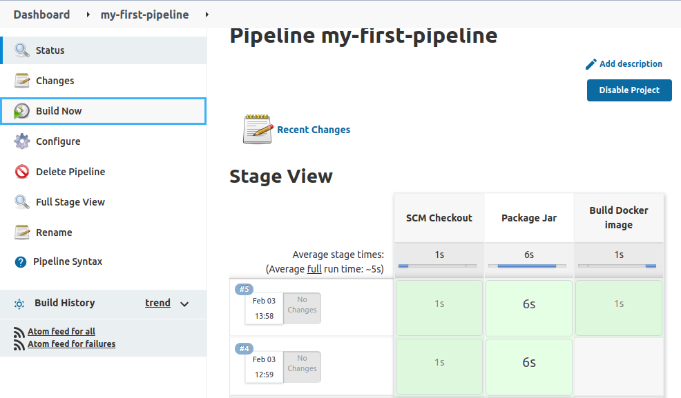

* P.S : if you get  **Got permission denied while trying to connect to the Docker daemon socket at unix:**  then you need to add Jenkins user to docker group by running the following command in your jenkins server terminal : 
    
    ```bash 
    sudo usermod -aG docker jenkins
    ```

#### **2.4 - Deploy & Test  :**

* Now we are at last step of our pipeline and the most important one .
* we'll deploy our application into a docker container for that :   
    * In your project main page click **Configure** in the left side bar.
    * Copy & Paste the following code to our pipeline script :
    
    ```bash 
     stage ("Deploy & Test"){
        echo(" Starting running container ")
        sh "docker container run -p 9090:9090 -d --name my-app my-app:1.0.0" 
        echo "--------------------------------------------------------"
        echo "View App deployed here: http://localhost:9090/home" 
        echo "--------------------------------------------------------" 
        }
    ```
    * Click Save .
    * In the project main Page Click Build Now.
    * The build was succeded and our application is ready to use .

        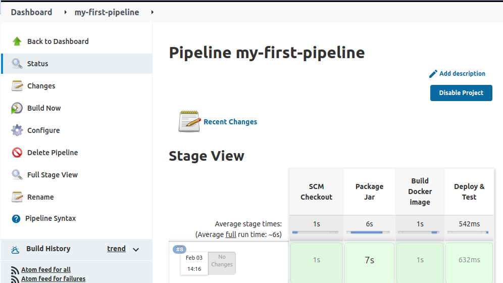

    * Now open your web browser and type http://localhost:9090/home .   

         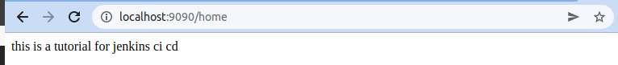


